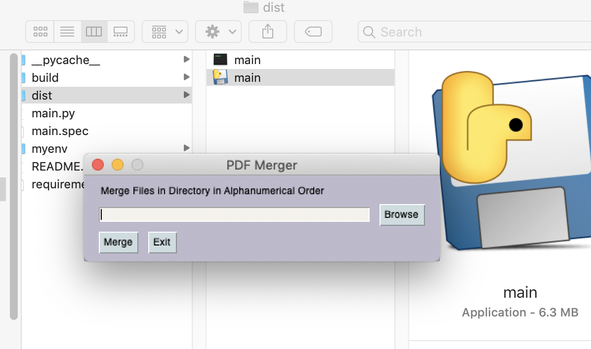

# PDF Merger

Built using PyPDF2 for pdf manipulation, and PySimpleGUI for the GUI.
Sadly it's TKinter so it looks like shit, but it's pretty speedy, and super simple.

It takes in a directory, sorts all the files ending in `.pdf`, and merges them in that order. It writes to the output of the python program as `merged-files.pdf`.